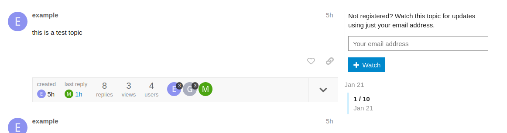
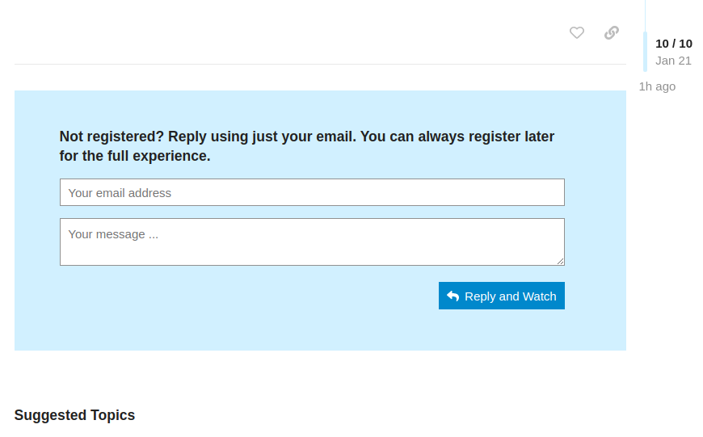

# Discourse Loners Plugin

The Loners plugin allows unregistered users to watch and reply to topics using only their email addresses.

Users become standard Discourse 'staged' users. Usernames are randomly generated. Because they are staged users, they can register later to become active users and claim their past posts.

For more information, please see: **url to meta topic**

## Screenshots

A "watch with email" widget is added above the right hand timeline

A "reply and watch with email" widget is added below the posts

## Installation

### Captcha

Google reCaptcha is supported. I recommend using v2 as v3 is not GDPR compliant by default.

Captchas are disabled by default since they require some configuration. I *strongly recommend* you enable them after installation or you *will* get registration spam.

1. Sign up for Google reCaptcha at https://www.google.com/recaptcha/
2. Allow the following urls in your Discourse's Content Security Policy at /admin/site_settings/category/all_results?filter=Content%20Security%20Policy
    https://www.google.com/recaptcha/
    https://www.gstatic.com/recaptcha/
3. Check "Enable Captcha" at /admin/site_settings/category/plugins?filter=plugin%3Adiscourse-loners

See https://meta.discourse.org/t/google-adsense-content-security-policy-error/135600 for more info.
